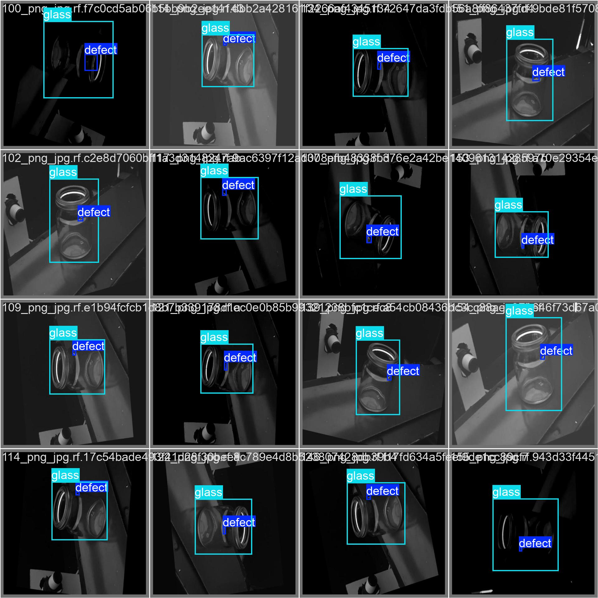
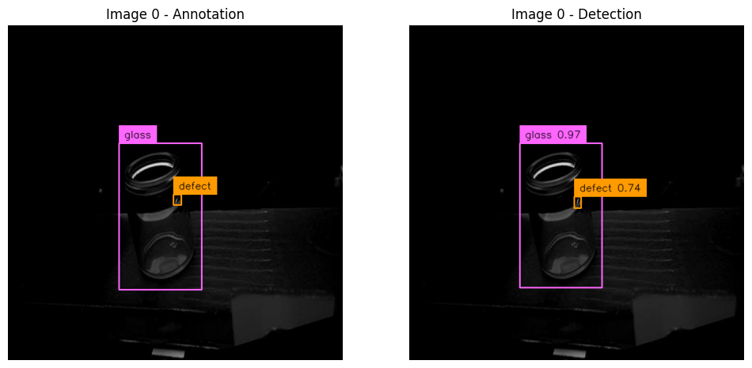
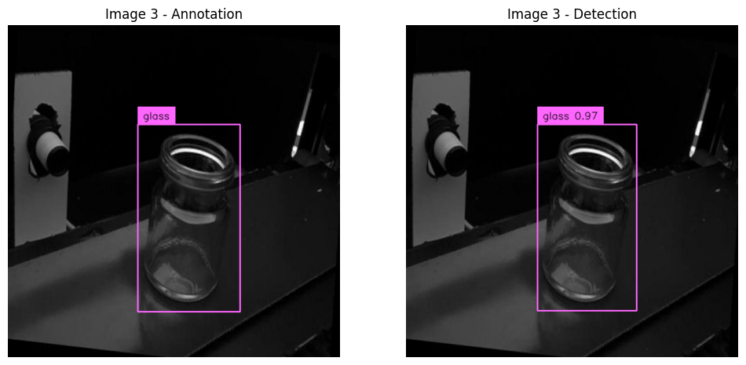
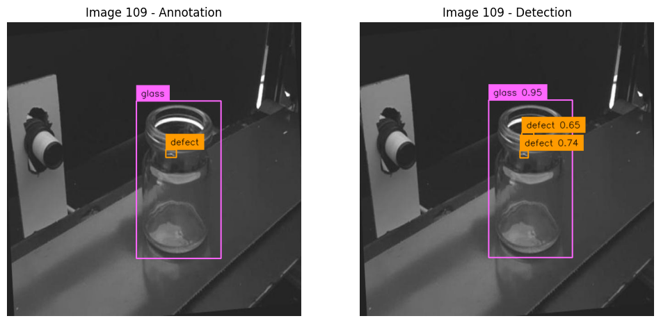
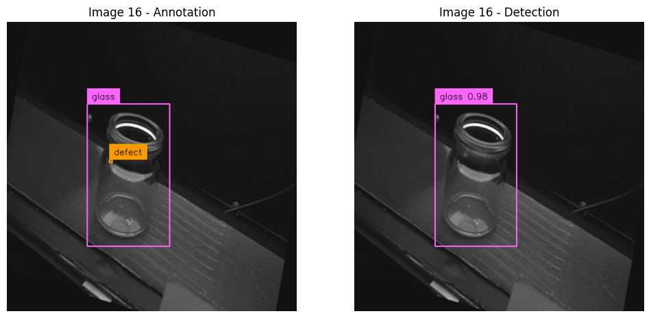
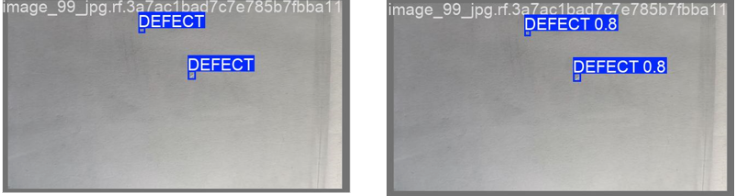
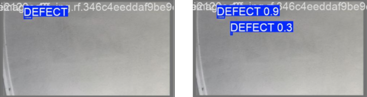
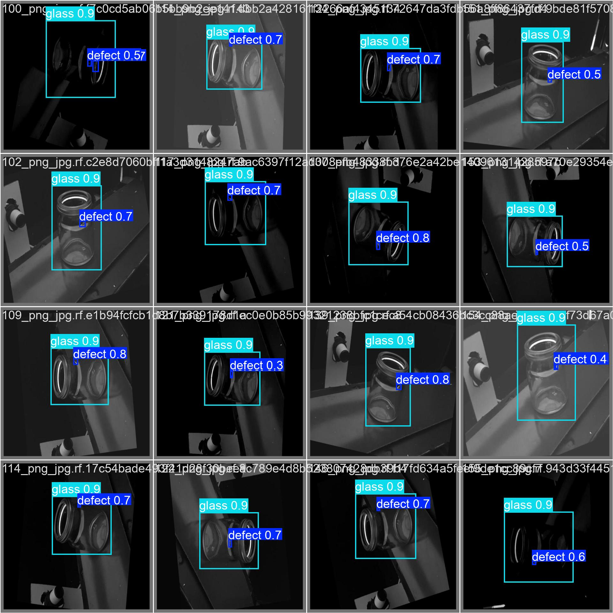
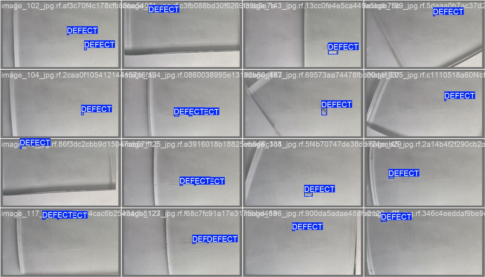
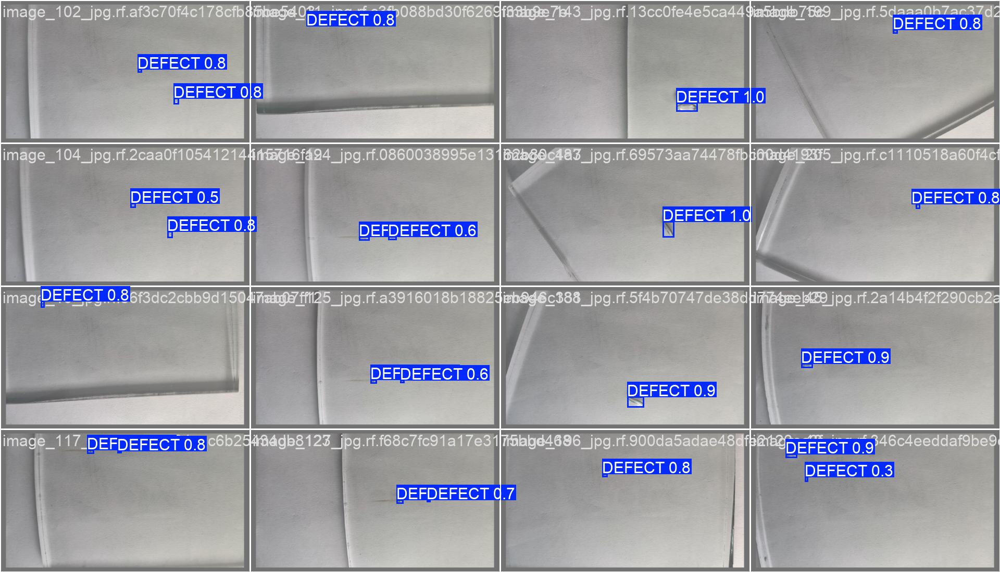

# Abstract {.unnumbered .unlisted}

### English Version

This project addressed the challenge of automated glass defect detection in the pharmaceutical sector, where the integrity of packaging vessels play an important role. The study quantitatively compared two different object detection architectures: the efficient YOLO Nano (CNN-based Single-Shot Detector) and the more resource-intensive RF-DETR Nano (Transformer-based), utilizing two discrete datasets representing simple and complex, real-world conditions. The results revealed a significant architectural difference: The YOLO model demonstrated overwhelming training efficiency (up to 70% faster than RF-DETR) and achieved superior statistical stability (lower standard deviation) in its performance metrics. However, the critical finding was the failure to meet stringent safety standards: The YOLO model's mean recall for defect detection on the complex dataset was only 0.634 and for the RF-DETR 0.842. This unacceptable rate of false negatives precludes both models from safe industrial deployment. The study concludes that, while the YOLO Nano architecture is the better choice among the tested models, the primary bottleneck is not architectural speed, but the lack of model robustness required to achieve the near-perfect recall necessary to guarantee product safety.




### German Version

Dieses Projekt befasste sich mit der Herausforderung der automatisierten Erkennung von Defekten auf Glasoberflächen, wo die Unversehrtheit von Verpackungsbehältern eine wichtige Rolle spielt. Die Studie verglich quantitativ zwei verschiedene Architekturen zur Objekterkennung: das effiziente YOLO Nano (CNN-basierter Single-Shot-Detektor) und das ressourcenintensivere RF-DETR Nano (Transformer-basiert). Dafür wurden zwei unterschiedliche Datensätze verwendet, die einfache und komplexe, reale Bedingungen repräsentieren. Die aggregierten finalen Testergebnisse zeigten einen signifikanten Unterschied: Das YOLO-Modell zeigte eine überwältigende Trainingseffizienz (bis zu 70% schneller) und erzielte eine überlegenere statistische Stabilität (geringere Standardabweichung) bei seinen Resultaten. Die entscheidende Erkenntnis war jedoch die Nichteinhaltung der strengen Sicherheitsstandards: Die mittlere Recall-Rate des YOLO-Modells für die Defekterkennung im komplexen Datensatz betrug nur 0.634, und für das RF-DETR-Modell 0.842. Diese inakzeptable Rate an False Negatives schliesst beide Modelle für einen sicheren industriellen Einsatz aus. Die Studie kommt zu dem Schluss, dass die YOLO Nano-Architektur zwar die bessere Wahl unter den getesteten Modellen ist, der limitierende Faktor jedoch nicht die Geschwindigkeit der Architektur ist, sondern die mangelnde Robustheit des Modells, die zur Erreichung der nahezu perfekten Recall-Rate zur Gewährleistung der Produktsicherheit notwendig ist.


# Acknowledgement {.unnumbered .unlisted}

I would like to express my sincere gratitude to Dr. Stefan Glüge for his valuable support and guidance throughout the writing and compilation process of this thesis. My thanks also goes to Dr. Robert Vorbuger for initiating and setting up the project.

::: {.content-hidden when-format="html"}

# Table of Contents {.unnumbered .unlisted}



:::

# List of Abbreviations {.unnumbered}

- **AI**: Aritficial Intelligence
- **AP**: Average Precision
- **CNN**: Convolutional Neural Network
- **COCO**: Common Objects in Context
- **CV**: Cross Validation
- **FN**: False Negative
- **FP**: False Positive
- **IoU**: Intersection over Union
- **mAP**: Mean Average Precision
- **RF-DETR**: Roboflow Detection Transformer
- **TN**: True Negative
- **TP**: True Positive
- **YOLO**: You Only Look Once

# Introduction

## Context and Motivation
Within the industrial sector, quality control represents a critical success factor. Specifically in pharmaceuticals and medical technology, the integrity of the primary packaging material (typically glass containers) is crucial for product safety.

The primary material used for medical and chemical glass containers generally consists of borosilicate glass. However, this material can exhibit or contain production-related defects, including particulate inclusions, air bubbles, or flexible fragments known as Lamellae [@Foglia2015AnIS].

The relevance of these quality deficiencies is highlighted by the consequences demonstrated by [@Foglia2015AnIS]: 


_"In recent years, more than 20
product recalls have been associated with glass issues, and over 100 million units of drugs packaged in vials or syringes have been withdrawn from the
market."_ 


This underscores the urgent necessity of reliable detection methods for such flaws.

The rapid advancement of Artificial Intelligence (AI) and fundamental mechanisms like deep learning allows for the application of object detectors for the automated recognition of the aforementioned defects. The attractiveness of these AI-based image recognition methods is continuously increasing [@10.1115/1.4049535]. However, as these procedures still represent a nascent field of research, comprehensive validation studies on their suitability and the achievability of the necessary performance in industrial use are lacking.

A central challenge in training robust models is the scarcity of extensive datasets [@10.1115/1.4049535]. Specifically, the naturally limited availability of data from defective products, caused by the significant imbalance in favor of intact units, complicates the creation of an adequate training dataset [@10.1115/1.4049535].

This work serves as an exploratory contribution to the evaluation of the current feasibility of AI-supported defect detection. The objective is the comparison of available models on the market in order to provide a well-founded statement on the realisability of precise defect determination.

## Overall Concept
The overall objective of this work was to conduct a quantitative performance comparison of two different object detection models on two different datasets. The experimental procedure was based on the following fundamental steps:

1. **Model selection and preparation:** Two specific, pre-trained foundation models from the class of object detectors were selected and initialized for evaluation.

2. **Data management and fine-tuning:** To test the models' generalizability, they were each finetuned to the specific classification task (defect detection) using two discrete datasets (dataset A and dataset B). Cross Validation was applied to ensure statistical robustness. 

3. **Performance evaluation:** The performance of the four trained model-dataset combinations was then evaluated on a separate, previously unseen test dataset. The performance was determined based on established quantitative metrics for object detection.

4. **Comparative analysis:** Finally, the generated results were visualized and subjected to a detailed comparative analysis. The aim was to identify the robustness, strengths, and weaknesses of the model architectures examined in relation to glass defect detection.

## Research Questions
Based on the challenges mentioned in **[Context and Motivation](#context-and-motivation)**, this study tries to answer following research questions:

  - How does the performance differ between the two investigated object detection models (Model X vs. Model Y), measured by Mean Average Precision (mAP), in detecting defects in the different datasets? Which one is superior?
  - Which performance benchmarks (e.g., minimum precision and recall values) must be achieved to deem the resulting reliability of the models as sufficient for deployment in real-world quality control scenarios?

## State of the Art
The quote from [@Buhl_2024] explains quite well what Object detection is:
 _"Object detection is a critical capability of computer vision that identifies and locates objects within an image or video. Unlike image classification, object detection not only classifies the objects in an image, but also identifies their location within the image by drawing a bounding box around each object."_

Given the lack of specific literature concerning the performance of contemporary object detectors on glass vial defect inspection, this study must rely on fundamental model performance benchmarks established by previous research. These benchmarks are typically derived from models trained on broad, general-purpose datasets.

The following analysis focuses on the existing comparative statistics for the chosen architectures: YOLO and RF-DETR.

{#fig-comparison-table}

The initial comparison in (@fig-comparison-table) provides a direct performance evaluation of various object detectors, including the two architectures selected for this paper (YOLOv11 Nano and RF-DETR Nano). Crucially, Non-Maximum Suppression (NMS), a fundamental post-processing algorithm, is utilised by YOLO to filter out overlapping, redundant bounding boxes, thereby ensuring that each object instance is identified only once [@Ultralytics_2025]. The results published by @robinson2025rfdetrneuralarchitecturesearch reveal significant architectural and performance differences between the nano variants:

- **Architectural Size:** The RF-DETR model possesses 30.5 million parameters (M), whereas the YOLO variant contains only 2.6M parameters. This disparity reflects a substantial difference in model complexity and memory footprint.

- **Detection Accuracy:** Correspondingly, the RF-DETR model achieves a higher Average Precision (AP) of 48.0%, while the YOLO model reaches an AP of 37.1%. 

This trend is maintained across varying Intersection over Union (IoU) overlap requirements.These results directly reflect the discrepancy in file size: The RF-DETR Nano model is approximately 349MB, while the YOLOv11 Nano model is only 57MB. This size difference represents a significant factor in the decision-making process regarding model selection for resource-constrained real-world deployment. Specifically, in industrial settings, where processing is often performed on decentralized, resource constrained Edge devices (such as industrial single board computers), models must be lightweight for efficient deployment, possess a minimal memory footprint, and maintain high inference speed to ensure the low latency and high throughput required for real time quality control.



**Contrasting Benchmarks**

Interestingly, the benchmark table presented by @sapkota2025rfdetrobjectdetectionvs, shown in (@fig-comparison-tabe-2)

{#fig-comparison-tabe-2}

, demonstrates partially conflicting results.

It is important to note that @sapkota2025rfdetrobjectdetectionvs utilised the newer YOLOv12 architecture and the Base variant of RF-DETR (with 29M parameters, slightly fewer than the Nano variant used in the @robinson2025rfdetrneuralarchitecturesearch study).

- **Single-Class Detection:** In the context of single-class object detection, the YOLOv12N model outperformed the RF-DETR architecture.

- **Multi-Class Detection:** Conversely, the ranking shifts for multi-class detection, where the RF-DETR model demonstrated superior performance compared to YOLOv12N.

This discrepancy highlights the critical need to define the intended application: the optimal choice depends heavily on whether the scenario involves single-class or multi-class detection.

**Research Gap and Contribution**

The contradictory performance findings observed in the literature, particularly the trade-off between model size and average precision [@robinson2025rfdetrneuralarchitecturesearch] and the impact of class complexity [@sapkota2025rfdetrobjectdetectionvs], underscore the need for further validation.

The present paper connects with this existing body of literature by providing an empirical, comparative evaluation of the YOLO and RF-DETR architectures under the specific constraints of glass defect detection and data imbalance. This aims to serve as a specific supplementary reference for the performance of these models in a industrial application.

# Methodology
## Datasets and Assumptions
The search for suitable data sets proved to be challenging due to the inherent imbalance in industrial production. As mentioned in the introduction, the lack of data is a key problem in the context of defect detection. For the experimental implementation, two separate data sets were selected. These data sets represent different product forms, but have the identical defect type of gas bubbles.


### Dataset A (Glasjars, Roboflow)
  The first dataset was an annotated dataset of glass jars. This dataset was obtained from the Roboflow platform [@roboflow_dataset].

  - **Defined classes:** This dataset contained two primary classes: the defect class (the gas bubble itself) and the container class (the glass container as an object). The models were trained to locate both the surrounding product and the specific defect using bounding boxes.

  - **Scope and division:** The dataset comprised a total of 1728 images. The division into the three essential subcategories of training set ("train"), validation set ("val") and test set ("test") was already predefined. This division was adopted for the subsequent analysis.


{#fig-roboflow-raw width=50%}

@fig-roboflow-raw shows that the images were caputred in monotone coloring, they are not autorotated, meaning the angle of the object is different in every picture.



### Dataset B (Glass Plates, Kaggle)
The second dataset was obtained from the Kaggle platform and was used to verify the model's performance on structurally different image data [@kaggle_dataset].

  - **Scope and distribution:** With a total of 208 images, this dataset was significantly smaller than dataset A. Here, too, the distribution into training, validation and test sets was predefined and was adopted for the analysis.

  - **Product and class definition:** In contrast to the first data set, dataset B did not contain images of entire pharmaceutical containers, but rather images of a glass plate that exhibited the defect. The classification was limited exclusively to the defect class (gas bubble). This set came annotated with the respective bounding boxes and the class "DEFECT".

  - **Important Feature:** A key feature of this data set was the guarantee that each image in the sample contained at least one defect. This represented a contrasting data basis to real production environments, as the natural imbalance between defective and intact samples was not represented here.

::: {layout-ncol=2}
{#fig-raw-kaggle-1}

{#fig-raw-kaggle-2}
:::

As shown in (@fig-raw-kaggle-1) and Figure (@fig-raw-kaggle-2), the extent of the gas bubbles varied significantly from microlesions to large-area defects. This variation placed demands on the localisation capability of the models across a wide range of sizes.

In view of the structural and qualitative differences between the data sets, a number of assumptions were formulated in advance.

- It was assumed that dataset A would be more challenging due to the different rotation angles of the images and the more complex classification. A longer training period and lower overall performance were expected here compared to dataset B.

- On the other hand, the small size of dataset B led to the hypothesis of low generalisability, although rapid learning was assumed on the internal test images.


## Model Selection
For the comparative part of the study, the decision was focused on two of the currently biggest architectures for object detection. This selection aimed to evaluate the performance of a conventional convolutional neural network (CNN)-based approach against a transformer-based model.

  - **YOLO (You Only Look Once)**
  The YOLO model was selected as the first reference detector. The model was developed by the software developer Ultralytics and is considered a real-time object detection and segmentation model. It is characterised by its high speed and efficient performance, making it one of the most commonly used one-stage detectors[@Ultralytics_2025].
  The YOLO Model's folder structure has the following components that are the same for every dataset. It consists of the aforementioned three folders: ´train´, ´val´, ´test´ and in addition, a YAML source file (Yet Another Markup Language) was used. This specified the file paths to the respective folders and defined the number and names of the classes contained in the data set. Each of the main folders are subdivided into two subfolders: 
      - One containing the image data without annotations.
      - The other containing five numbers: The class id, center_x, center_y, width and height of the bounding box 


  - **RF-DETR (Roboflow Detection Transformer)**
  The folder structure required for the RF-DETR model differed fundamentally from the YOLO standard, necessitating the use of the Common Objects in Context (COCO) format.

  Similar to the preceding model, the directory maintained the main divisions (train, val, test). However, the key architectural distinction resided in the annotation storage. Instead of utilizing individual label files per image, each main folder contained a single JSON (JavaScript Object Notation) file that held all annotation information for the respective subset.

  The structure of this JSON file adhered to the COCO standard, encompassing the following five key elements:

  1. Dataset Information: General metadata regarding the dataset itself.
  2. License Information: Details concerning data usage rights.
  3. Categories: A definition of the classes present in the dataset. A specific feature of the COCO format was the mandatory inclusion of a Supercategory (e.g., 'Animals'), under which individual classes (e.g., 'Cat') were assigned.
  4. Image Information: Metadata for each image, such as file name and dimensions.
  5. Annotation Information: Detailed annotation data for each instance, including the object's id, the corresponding image_id, the category_id, the bounding box coordinates, the area (in square pixels), and the segmentation information (segmentation and is_crowd variables)

For the experimental evaluation, the Nano variant (YOLOv11n, RFDETR-nano) was deliberately selected for both the YOLO and the RF-DETR architecture.

## Model Mechanics
### **YOLO (You Only Look Once)**
The YOLO (You Only Look Once) model is a real-time object detection system which fundamentally differs from traditional multi-stage detectors by processing the input image in a single pass. This architectural choice classifies YOLO as a Single-Shot Detector (SSD).

This type of detector employs an algorithm that predicts the bounding box coordinates and the corresponding class probability of the detected object simultaneously and in one step. The primary beneficial consequence of this unified approach is a significant increase in processing speed [@Buhl_2024]. Consequently, the simultaneous prediction of the object's presence and its precise location accelerates the overall detection process, making it highly suitable for real-time applications.

### **RF-DETR (Roboflow Detection Transformer)**
As the comparative alternative architecture, the RF-DETR (Roboflow Detection Transformer) model was selected. This model represents a real-time, state-of-the-art transformer-based architecture specifically designed for object detection and instance segmentation [@robinson2025rfdetrneuralarchitecturesearch].

The RF-DETR architecture leverages a Vision Transformer (ViT) to effectively extract multiscale features from the input image.

Following feature extraction, the model utilizes a balanced combination of two distinct attention mechanisms:

- **Windowed Attention Blocks:** These restrict the self-attention mechanism to a local neighbourhood, which significantly improves processing speed.

- **Non-Windowed Attention Blocks:** These enable global interaction across features, which contributes to overall detection accuracy.

This deliberate balance helps maintain high performance while ensuring the model remains fast enough for real-time applications. Subsequently, the deformable cross-attention layers and the segmentation head bilinearly interpolate the output. Finally, the detection and segmentation losses are applied to all decoder layers during the training process [@robinson2025rfdetrneuralarchitecturesearch].



### YOLO vs RF-DETR
The selection of YOLO and RF-DETR for the experimental evaluation is based on their fundamental architectural divergence. Although both models are utilized for the same purpose, object detection and localization of defects, they differ significantly in their internal working structure.

## Model Training
The training procedure for both the YOLO and RF-DETR architectures was carried out under identical computational and hyperparameter conditions to ensure a fair and direct comparative evaluation.

  - **Computational Environment:** All training and validation processes were conducted on the Kaggle Coding environment, utilizing an NVIDIA T4 GPU equipped with 16GB of VRAM (Video Random Access Memory).

  - **Hyperparameters:** Both models were trained for a fixed duration of 100 epochs. A total batch size of 16 and a learning rate of 0.0001 were applied consistently across all four training runs (YOLO on Datasets A and B; RF-DETR on Datasets A and B). The other Hyperparameters were left as they are configured when starting the training.

  - **Cross Validation:** The training procedure involved 5-fold Cross Validation (CV). The specific CV technique varied depending on the complexity of the dataset's class distribution:  
  
    - **Dataset A (Two Classes):** Stratified K-Fold CV was applied. This method ensured that the proportion of instances for the two defined classes was preserved in every fold.  
    
    - **Dataset B (Single Class):** Standard K-Fold CV was applied. Since this dataset contained only a single defect class, standard K-Fold CV was utilized, as stratification was not necessary.  
  
  The consistent use of the entire dataset for this CV process was methodologically mandatory to establish a scientific benchmark, allowing for a fair comparison of the models' true generalization capabilities.

## Model Testing
The final testing of the trained models was conducted under the same computational conditions as the training phase. The best weights of each fold was selected. For evaluation, the separate test splits of both Datasets A and B were used exclusively. This ensured that the model performance metrics were derived from data the models had not previously encountered during the training or validation phases.

## Evaluation Metrics
The performance of the models was assessed using standard metrics commonly applied in object detection and machine learning. These metrics were calculated based on the following fundamental classifications:

  - **True Positives:** The model correctly identified a defect, and the predicted bounding box sufficiently overlapped with the ground truth annotation.

  - **True Negatives:** The model correctly identified the absence of a defect in an area where none was present.

  - **False Positives:** The model predicted a defect where the ground truth showed none (a false alarm).

  - **False Negatives :** The model failed to predict a defect where one was present (a missed detection).

Given these fundamental metrics, the following performance indicators were calculated:

  - **Precision:** This metric measures the accuracy of the positive predictions, indicating the proportion of positively predicted instances that were truly correct. $$Precision = \frac{TP}{TP+FP}$$
  
  - **Recall:** This metric measures the model's ability to find all actual positive instances, indicating the proportion of actual defects that were successfully located. $$Recall = \frac{TP}{TP+FN}$$
  
  - **F1-Score:** The F1-Score represents the harmonic mean of Precision and Recall, providing a single metric that balances both factors. $$F1-Score = \frac{2 \cdot Precision \cdot Recall}{Precision + Recall}$$

  - **Intersection over Union (IoU):** IoU measures the degree of overlap between the model's predicted bounding box and the ground truth bounding box. It is calculated as the area of intersection divided by the area of union of the two boxes.
  $$IoU = \frac{TP}{(TP+FP+FN)}$$

  - **mAP@50 (Mean Average Precision at IoU 50):** The mAP is the mean of the Average Precision (AP) across all classes. The AP, in turn, represents the Area Under the Precision-Recall Curve. The suffix $@50$ indicates that only detections with an IoU overlap of at least 50% with the ground truth bounding box were considered true positives for the calculation. $$mAP@50 = \frac{1}{N} \sum_{i=1}^{N} AP_i@50$$

# Results
## Model Results of Training

### Metrics comparison

The time required for the Fine-Tuning process was recorded between the two model architectures. The observed data are presented in @tbl-trainingtime.

```{python}
#| tbl-cap: Training Duration
#| label: tbl-trainingtime

import numpy as np
import pandas as pd

# Daten für die Trainingszeiten
data = {
    "Model": ["YOLO", "RF-DETR", "YOLO", "RF-DETR"],
    "Dataset": ["Dataset (A)", "Dataset (A)", "Dataset (B)", "Dataset (B)"],
    "Train Time (Approx.)": ["~ 200 min", "~ 720 min (2 runs) / (~1500 min for 5 runs)", "~ 25 min", "~ 111 min"]
}

# DataFrame erstellen
df_train_time = pd.DataFrame(data, index=None)

# Anzeige des DataFrames
df_train_time.style.hide(axis="index")
```

### Dataset A


The stratified 5-fold cross validation produced results displayed in (@tbl-5cv-dataseta-yolo-folds).

:::{layout-ncol=2}

```{python}

#| tbl-cap: "YOLO (Validation)"
#| label: tbl-5cv-dataseta-yolo-folds

data_val = [
    {
        "Fold": 1,
        "Precision": [0.849, np.nan],
        "Recall": [0.796, np.nan],
        "mAP50": 0.817,
        "mAP50-95": 0.584,
    },
    {
        "Fold": 2,
        "Precision": [0.815, np.nan],
        "Recall": [0.812, np.nan],
        "mAP50": 0.831,
        "mAP50-95": 0.593,
    },
    {
        "Fold": 3,
        "Precision": [0.836, np.nan],
        "Recall": [0.793, np.nan],
        "mAP50": 0.824,
        "mAP50-95": 0.57,
    },
    {
        "Fold": 4,
        "Precision": [0.841, np.nan],
        "Recall": [0.761, np.nan],
        "mAP50": 0.811,
        "mAP50-95": 0.575,
    },
    {
        "Fold": 5,
        "Precision": [0.838, np.nan],
        "Recall": [0.818, np.nan],
        "mAP50": 0.846,
        "mAP50-95": 0.591,
    }
]

# DataFrame erstellen
df_val = pd.DataFrame(data_val)

# Precision & Recall Listen aufsplitten: Index 0 = Defect, Index 1 = Glass
df_val['Precision_defect'] = df_val['Precision'].apply(lambda x: x[0])
df_val['Precision_glass'] = df_val['Precision'].apply(lambda x: x[1])
df_val['Recall_defect'] = df_val['Recall'].apply(lambda x: x[0])
df_val['Recall_glass'] = df_val['Recall'].apply(lambda x: x[1])

# Alte Spalten entfernen und sortieren
df_val_final = df_val.drop(columns=['Precision', "Recall"])
df_val_final = df_val_final[['Fold','Precision_defect', 'Precision_glass', 'Recall_defect', 'Recall_glass', 'mAP50', 'mAP50-95']]

col_yolo = [col for col in df_val_final if col != "Fold"]

df_val_final.style.format("{:.3f}", subset=col_yolo).hide(axis="index")
```

:::


{#fig-yolo-roboflow-train}

The stratified 2-fold cross validation produced results displayed in (@tbl-5cv-dataseta-rfdetr-val).

```{python}
#| tbl-cap: "RF-DETR (Validation)"
#| label: tbl-5cv-dataseta-rfdetr-val

import numpy as np
import pandas as pd

rfdetr_roboflow_val = [{
    "Fold": 1,
    "Precision": [0.697, np.nan],
    "Recall": [0.78508772, np.nan],
    "mAP50": 0.830,
    "mAP50-95": 0.603
},
{
    "Fold": 2,
    "Precision": [0.810, np.nan],
    "Recall": [0.85388128, np.nan],
    "mAP50": 0.886,
    "mAP50-95": 0.673
}]

# DataFrame erstellen
df_rfdetr_robo_val = pd.DataFrame(rfdetr_roboflow_val)


# Precision & Recall Listen aufsplitten: Index 0 = Defect, Index 1 = Glass
df_rfdetr_robo_val['Precision_defect'] = df_rfdetr_robo_val['Precision'].apply(lambda x: x[0])
df_rfdetr_robo_val['Precision_glass'] = df_rfdetr_robo_val['Precision'].apply(lambda x: x[1])
df_rfdetr_robo_val['Recall_defect'] = df_rfdetr_robo_val['Recall'].apply(lambda x: x[0])
df_rfdetr_robo_val['Recall_glass'] = df_rfdetr_robo_val['Recall'].apply(lambda x: x[1])

# Alte Spalten entfernen und sortieren
df_rfdetr_robo_val_final = df_rfdetr_robo_val.drop(columns=['Precision', 'Recall'])
df_rfdetr_robo_val_final = df_rfdetr_robo_val_final[[
  'Fold',
  'Precision_defect', 
  'Precision_glass', 
  'Recall_defect', 
  'Recall_glass', 
  'mAP50', 
  'mAP50-95']]

cols_rf = [col for col in df_rfdetr_robo_val_final if col != "Fold"]

df_rfdetr_robo_val_final.style.format("{:.3f}", subset=cols_rf).hide(axis="index")

```


{#fig-rfdetr-roboflow-train}  

### Comparison of Means and Std.

The values of [@tbl-5cv-dataseta-yolo-folds] and [@tbl-5cv-dataseta-rfdetr-val] have been aggregated and are displayed in [@tbl-5cv-dataseta-yolo-agg] and [@tbl-5cv-dataseta-rfdetr-agg] and compared in (@fig-valid-data-a).

:::{layout-ncol=2}

```{python}
#| tbl-cap: "Aggregated Values YOLO 5-Fold"
#| label: tbl-5cv-dataseta-yolo-agg

### YOLO-Roboflow_val
summary_yolo_val = df_val_final.drop(columns=['Fold']).agg(['mean', 'std'])

summary_yolo_val = round(summary_yolo_val.T.rename(columns={"mean": "Mean", "std": "Std (+-)"}),3)

summary_yolo_val
```

```{python}
#| tbl-cap: "Aggregated Values RF-DETR 2-Fold"
#| label: tbl-5cv-dataseta-rfdetr-agg

### RF-DETR-Roboflow_val
# Berechnung von Mittelwert (mean) und Standardabweichung (std)
summary_robo_rfdetr_val_final = df_rfdetr_robo_val_final.drop(columns=['Fold']).agg(['mean', 'std'])

summary_robo_rfdetr_val_final = round(summary_robo_rfdetr_val_final.T.rename(columns={"mean": "Mean", "std": "Std (+-)"}),3)

summary_robo_rfdetr_val_final
```

:::


{#fig-valid-data-a}  



### Dataset B

The 5-fold cross validation produced results displayed in (@tbl-5cv-datasetb-yolo).

```{python}
#| tbl-cap: "YOLO (Validation)"
#| label: "tbl-5cv-datasetb-yolo"
#| 
#### YOLO-Kaggle-Results-Val

data_kaggle_yolo_val = [{
    "Fold": 1,
    "Precision": 0.998,
    "Recall": 1,
    "mAP50": 0.995,
    "mAP50-95": 0.821
},
{
    "Fold": 2,
    "Precision": 0.998,
    "Recall": 1,
    "mAP50": 0.995,
    "mAP50-95": 0.844
},
{
    "Fold": 3,
    "Precision": 0.997,
    "Recall": 0.967,
    "mAP50": 0.972,
    "mAP50-95": 0.798
},
{
    "Fold": 4,
    "Precision": 1,
    "Recall": 1,
    "mAP50": 0.995,
    "mAP50-95": 0.838
},
{
    "Fold": 5,
    "Precision": 0.997,
    "Recall": 1,
    "mAP50": 0.995,
    "mAP50-95": 0.822
}
]

yolo_kaggle_val_df = pd.DataFrame(data_kaggle_yolo_val)

num_cols = [col for col in yolo_kaggle_val_df if col != "Fold"]

yolo_kaggle_val_df.style.format("{:.3f}", subset=num_cols).hide(axis="index")

```

{#fig-yolo-kaggle-train}


The 5-fold cross validation produced results displayed in (@tbl-5cv-datasetb-rfdetr).

```{python}
#| tbl-cap: "RF-DETR (Validation)"
#| label: tbl-5cv-datasetb-rfdetr


### Validation RF-DETR-Kaggle

import pandas as pd

# Daten basierend auf dem Screenshot
data_val = {
    'Fold': [1, 2, 3, 4, 5],
    # Validation Daten
    'Precision': [1, 1, 1, 1, 1], ## from confusion, with Precision() its not quite right
    'Recall': [1.0, 1.0, 1.0, 1.0, 1.0],
    'mAP50': [1.0, 1.0, 1.0, 1.0, 1.0],
    'mAP50-95': [0.785670, 0.853004, 0.909271, 0.901233, 0.907649],
}


# Erstellen des gesamten DataFrames
df_val = pd.DataFrame(data_val)


num_cols_val = [col for col in df_val if col != "Fold"]


df_val.style.format("{:.3f}", subset=num_cols_val).hide(axis="index")


```

{#fig-rfdetr-kaggle-train}


### Comparison of Mean and Std

The values of [@tbl-5cv-datasetb-yolo] and [@tbl-5cv-datasetb-rfdetr] have been aggregated and are displayed in [@tbl-5cv-datasetb-yolo-agg] and [@tbl-5cv-datasetb-rfdetr-agg] and compared in (@fig-valid-data-b).

:::{layout-ncol=2}

```{python}
#| tbl-cap: "YOLO (Validation)"
#| label: tbl-5cv-datasetb-yolo-agg

## YOLO-Kaggle-Results-Val Mean + Std

yolo_kaggle_val_df = round(yolo_kaggle_val_df.drop(columns="Fold").agg(["mean", "std"]).rename({"mean": "Mean", "std": "Std (+-)"}),3)

yolo_kaggle_val_df.T

```

```{python}
#| tbl-cap: "RF-DETR (Validation)"
#| label: tbl-5cv-datasetb-rfdetr-agg

## RF-DETR Validation Mean + Std
summary_rfdetr_kaggle_val = df_val.drop(columns=['Fold']).agg(['mean', 'std'])

summary_rfdetr_kaggle_val = round(summary_rfdetr_kaggle_val.rename({"mean": "Mean", "std": "Std (+-)"}),3)
summary_rfdetr_kaggle_val.T

```

:::

{#fig-valid-data-b} 



## Model Results and Statistical Evaluation of Testing

### Dataset A

Following results have been achieved on the testing set by the models:

```{python}
#| tbl-cap: "Test Performance YOLO 5 Fold"
#| label: tbl-dataseta-test-yolo
#| 
# Deine Ergebnisse aus der 5-Fold Cross-Validation
data_test = [
    {
        "Fold": 1,
        "Precision": [0.7514621966286971, 0.9671146226696267],
        "Recall": [0.5702702702702702, 0.9166666666666666],
        "mAP50": 0.817217,
        "mAP50-95": 0.563044,
    },
    {
        "Fold": 2,
        "Precision": [0.7385323545021348, 0.9627684545208934],
        "Recall": [0.6494995472899632, 0.9715799732608127],
        "mAP50": 0.837757,
        "mAP50-95": 0.589359,
    },
    {
        "Fold": 3,
        "Precision": [0.7381310342963431, 0.9619391630191857],
        "Recall": [0.6630434782608695, 0.9468563665758085],
        "mAP50": 0.835691,
        "mAP50-95": 0.567396,
    },
    {
        "Fold": 4,
        "Precision": [0.7367265344526664, 0.9684008740259846],
        "Recall": [0.6235435144157984, 0.9596541786743515],
        "mAP50": 0.825140,
        "mAP50-95": 0.579171,
    },
    {
        "Fold": 5,
        "Precision": [0.6915238029656346, 0.9463481568322523],
        "Recall": [0.6657824933687002, 0.976878612716763],
        "mAP50": 0.824331,
        "mAP50-95": 0.585665,
    }
]

# DataFrame erstellen
df_test = pd.DataFrame(data_test)

# Precision & Recall Listen aufsplitten: Index 0 = Defect, Index 1 = Glass
df_test['Precision_defect'] = df_test['Precision'].apply(lambda x: x[0])
df_test['Precision_glass'] = df_test['Precision'].apply(lambda x: x[1])
df_test['Recall_defect'] = df_test['Recall'].apply(lambda x: x[0])
df_test['Recall_glass'] = df_test['Recall'].apply(lambda x: x[1])

# Alte Spalten entfernen und sortieren
df_test_final = df_test.drop(columns=['Precision', "Recall"])
df_test_final = df_test_final[['Fold','Precision_defect', 'Precision_glass', 'Recall_defect', 'Recall_glass', 'mAP50', 'mAP50-95']]


col_yolo = [col for col in df_val_final if col != "Fold"]

df_test_final.style.format("{:.3f}", subset=col_yolo).hide(axis="index")


```

```{python}

#| tbl-cap: "Test Performance RF-DETR 2-Fold"
#| label: tbl-dataseta-test-rfdetr


rfdetr_roboflow_test = [{
    "Fold": 1,
    "Precision": [0.718, np.nan],
    "Recall": [0.77272727, 1.000],
    "mAP50": 0.838,
    "mAP50-95": 0.599
},
{
    "Fold": 2,
    "Precision": [0.887, np.nan],
    "Recall": [0.91081081, 1.000],
    "mAP50": 0.933,
    "mAP50-95": 0.694
}]


# DataFrame erstellen
df_rfdetr_robo_test = pd.DataFrame(rfdetr_roboflow_test)

# Precision & Recall Listen aufsplitten: Index 0 = Defect, Index 1 = Glass
df_rfdetr_robo_test['Precision_defect'] = df_rfdetr_robo_test['Precision'].apply(lambda x: x[0])
df_rfdetr_robo_test['Precision_glass'] = df_rfdetr_robo_test['Precision'].apply(lambda x: x[1])
df_rfdetr_robo_test['Recall_defect'] = df_rfdetr_robo_test['Recall'].apply(lambda x: x[0])
df_rfdetr_robo_test['Recall_glass'] = df_rfdetr_robo_test['Recall'].apply(lambda x: x[1])

# Alte Spalten entfernen und sortieren
df_rfdetr_robo_test_final = df_rfdetr_robo_test.drop(columns=['Precision', 'Recall'])
df_rfdetr_robo_test_final = df_rfdetr_robo_test_final[['Fold','Precision_defect', 'Precision_glass', 'Recall_defect', 'Recall_glass', 'mAP50', 'mAP50-95', 
                      ]]

df_rfdetr_robo_test_final.style.format("{:.3f}", subset=cols_rf).hide(axis="index")

```

Both [@tbl-dataseta-test-yolo] and [@tbl-dataseta-test-rfdetr] have been aggregated:


:::{layout-ncol=2}

```{python}
#| tbl-cap: "Testing YOLO (Aggregated)"
#| label: tbl-test-dataseta-yolo-agg

# Berechnung von Mittelwert (mean) und Standardabweichung (std)
summary_test = df_test_final.drop(columns=['Fold']).agg(['mean', 'std'])

summary_test = round(summary_test.T.rename(columns={"mean": "Mean", "std": "Std (+-)"}),3)

summary_test

```

```{python}
#| tbl-cap: "Testing RF-DETR (Aggregated)"
#| label: tbl-test-dataseta-rfdetr-agg

# Berechnung von Mittelwert (mean) und Standardabweichung (std)
summary_robo_rfdetr_test_final = df_rfdetr_robo_test_final.drop(columns=['Fold']).agg(['mean', 'std'])

summary_robo_rfdetr_test_final = round(summary_robo_rfdetr_test_final.T.rename(columns={"mean": "Mean", "std": "Std (+-)"}),3)

summary_robo_rfdetr_test_final

```

:::



A comparison graph has been created:


{#fig-datasetA-comp}

### Dataset B

The testing of the models on the dataset B yielded following results:

```{python}
#| tbl-cap: "Test Performance YOLO 5 Fold"
#| label: tbl-datasetb-test-yolo


### YOLO-Kaggle-Test

# Daten aus der Benutzereingabe
data = [
    {
        "Fold": 1,
        "Precision": 0.9772674114421703,
        "Recall": 1.0,
        "mAP50": 0.994592,
        "mAP50-95": 0.819206,
       
    },
    {
        "Fold": 2,
        "Precision": 0.9797221042867775,
        "Recall": 1.0,
        "mAP50": 0.994444,
        "mAP50-95": 0.831578
        
    },
    {
        "Fold": 3,
        "Precision": 1.0,
        "Recall": 0.9751540154585319,
        "mAP50": 0.994600,
        "mAP50-95": 0.788892
            
    },
    {
        "Fold": 4,
        "Precision": 0.9987336240133619,
        "Recall": 0.9615384615384616,
        "mAP50": 0.985325,
        "mAP50-95": 0.808739
   
    },
    {
        "Fold": 5,
        "Precision": 0.9994167272567542,
        "Recall": 1.0,
        "mAP50": 0.995000,
        "mAP50-95": 0.851857
        
    }
]


df = pd.DataFrame(data)

num_cols = [col for col in df if col != "Fold"]

df.style.format("{:.3f}", subset=num_cols).hide(axis="index")


```

```{python}

#| tbl-cap: "Test Performance RF-DETR 5-Fold"
#| label: tbl-datasetb-test-rfdetr

## RF-DETR-Kaggle Test

import pandas as pd


data_test = {
    'Fold': [1, 2, 3, 4, 5],
    'Precision': [0.986, 1, 1, 1, 1],
    'Recall': [1.000000, 1.000000, 1.000000, 1.000000, 0.980392],
    'mAP50': [1.000000, 1.000000, 1.000000, 1.000000, 0.980198],
    'mAP50-95': [0.777840, 0.881448, 0.885093, 0.913619, 0.892534]
}

df_test = pd.DataFrame(data_test)

df_test = df_test[['Fold', "Precision", "Recall", 'mAP50', 'mAP50-95']].copy()


num_cols_test = [col for col in df_test if col != "Fold"]

# Zusammenfassung berechnen

df_test.style.format("{:.3f}", subset=num_cols_test).hide(axis="index")

```

From [@tbl-datasetb-test-yolo] and [@tbl-datasetb-test-rfdetr] the following aggregations and comparison plot have been generated:

:::{layout-ncol=2}

```{python}
#| tbl-cap: "Testing YOLO (Aggregated)"
#| label: tbl-test-datasetb-yolo-agg

### YOLO-Kaggle-Test Mean + Std


# Zusammenfassung berechnen
summary_yolo_kaggle_test = df.drop(columns=['Fold']).agg(['mean', 'std'])

summary_yolo_kaggle_test = round(summary_yolo_kaggle_test.rename({"mean": "Mean", "std": "Std (+-)"}),3)


summary_yolo_kaggle_test.T
```

```{python}
#| tbl-cap: "Testing RF-DETR (Aggregated)"
#| label: tbl-test-datasetb-rfdetr-agg

## RF-DETR-Kaggle Test Mean + Std

summary_test_rfdetr_kaggle = df_test.drop(columns=['Fold']).agg(['mean', 'std'])

summary_test_rfdetr_kaggle = round(summary_test_rfdetr_kaggle.rename({"mean": "Mean", "std": "Std (+-)"}),3)

summary_test_rfdetr_kaggle.T
```

:::

{#fig-datasetB-comp}



## Sample Images of Testing

This section displays the ground truth's vs the predictions for each case.

### Dataset A

{#fig-TP-roboflow}

{#fig-TN-roboflow}

{#fig-FP-roboflow}

{#fig-FN-roboflow}



### Dataset B

{#fig-TP-kaggle}

{#fig-FP-kaggle}


# Discussion

## Interpretation of Results

### Training Efficiency
The recorded training duration data explicitly validated the hypothesis concerning the computational overhead associated with the Transformer-based architecture. The YOLO model demonstrated superior computational efficiency, requiring up to seven times less training time (200 minutes vs. theoretical 1500 minutes on Dataset A). This finding underscored the critical advantage of the Single-Shot Detector approach for resource-constrained or time-sensitive development environments. The efficiency difference confirmed that the YOLO architecture better aligns with the lightweight requirements established in the research scope.  

An attempt to execute the full 5-fold Cross Validation (CV) on the RF-DETR model was initiated, but proved impossible due to resource limitations. Given that a single RF-DETR training run on Dataset A required approximately 5 hours (300 minutes), the full 5-fold CV process would have necessitated a continuous execution time exceeding 25 hours. The available computational resources were insufficient for such a sustained, long duration, which constrained the RF-DETR model's final evaluation to only two runs on Dataset A. The model is consequently evaluated based on these two runs, a judgment considered fair because it accurately reflects the current state of its operational feasibility and resource constraints.


### Analysis of Training Dynamics

The dynamic behavior of the models during the 100 epochs was analyzed using the loss and metric curves. It is crucial to note that the scaling of the axes in the provided visualizations differed significantly between the YOLO and RF-DETR output formats, necessitating careful comparative observation.  


**Definition of YOLO Loss Components**  

For the YOLO model, the following loss components were monitored:

  - **Box Loss ($\text{box\_loss}$):** Quantifies the accuracy with which the model predicts the position and size (bounding box) of the detected object.

  - **Classification Loss ($\text{cls\_loss}$):** Measures the accuracy of the model's classification of the detected object.

  - **Distribution Focal Loss ($\text{dfl\_loss}$):** Improves the bounding box estimation by modeling the coordinates as probability distributions instead of simple discrete values.


**Training Dynamics on Dataset A** 

As observed in the training results for both models (@fig-yolo-roboflow-train for YOLO and @fig-rfdetr-roboflow-train for RF-DETR), the loss curves indicated a steady decrease across the 100 epochs. For both architectures, the train and val losses did not fully converge before the 100th epoch, and no clear signs of overfitting or underfitting were present (i.e., the validation loss continued to decrease or remained stable).  

This behavior suggested that the full 100 epochs were necessary to achieve the recorded level of performance on this more complex dataset. It is plausible that a moderate increase in the epoch count beyond 100 could have potentially yielded further marginal improvements in the subsequent prediction accuracy.


The aggregated data from the validation phase (@tbl-5cv-dataseta-yolo-agg and @tbl-5cv-dataseta-rfdetr-agg) indicated a numerically slight superiority for the RF-DETR model over the YOLO model, an observation visually supported by the corresponding graph (@fig-valid-data-a). However, the higher variance associated with the RF-DETR's performance rendered its observed higher mean unreliable. The instability confirmed that the minimal numerical advantage achieved by the RF-DETR was not trustworthy compared to the statistical certainty of the YOLO model.


**Training Dynamics on Dataset B**

The effect of data scarcity on Dataset B (only 208 images) was distinctly visible in the training plots (@fig-yolo-kaggle-train for YOLO and @fig-rfdetr-kaggle-train for RF-DETR). 

While the loss curves continued a steady, albeit oscillating, decline, the Average Precision (mAP@50) metric converged very rapidly. For both models, the mAP@50 curve reached near-maximal performance around or shortly after the 20 th epoch. This rapid plateauing of the core evaluation metric indicated that the models learned the limited defect variance present in Dataset B relatively quickly. Consequently, the remaining 80 epochs were likely redundant for maximizing performance on this specific dataset. A predefined Early Stopping strategy or a reduction of the epoch count after the 20 th epoch could have significantly reduced the computational time without negatively impacting the achieved test performance.

**High Scores and Zero Variance:** The RF-DETR model achieved perfect mean scores for Precision, Recall, and mAP50 ($1.000 \pm 0.000$) (@tbl-5cv-datasetb-rfdetr-agg). The YOLO model also performed well (Recall 0.993 $\pm 0.015$) (@tbl-5cv-datasetb-yolo-agg).

**Structural Constraint:** These high metrics did not provide a reliable measure of the models' sensitivity to true negative scenarios (nondefect images) as the dataset was guaranteed to contain defects.


### Testing Efficiency

### Performance on Dataset A
The evaluation on Dataset A provided the clear delineation of the models' practical suitability, drawing upon the aggregated mean and standard deviation from the test performance (@tbl-test-dataseta-yolo-agg and @tbl-test-dataseta-rfdetr-agg):

- **Precision and False Positives** The YOLO architecture achieved a Precision_defect of 0.731 ($\pm 0.023$) , while the RF-DETR model achieved a numerically higher mean of 0.802, but with a significantly larger standard deviation of $\pm 0.120$. For the pharmaceutical context, where minimizing unnecessary product rejection is critical for cost management, YOLO's superior statistical stability established a substantial practical advantage. 

- **Critical Relevance on False Negatives**: In pharmaceutical applications, the identification of false negatives is of critical importance. An FN means that a structurally defective glass container is classified as intact and subsequently filled with a sterile medication. This poses an immediate risk to patient safety and can result in catastrophic product recalls. In the hierarchy of error costs, an FN error (safety risk) therefore weighs considerably more heavily than an FP.

- **Recall analysis:** With a mean Recall_defect of only 0.634 ($\pm 0.040$), the YOLO model demonstrated an unacceptable safety gap, as it failed to detect over one-third of existing defects. Although the RF-DETR model achieved a significantly higher mean Recall_defect of 0.842 ($\pm 0.098$), this mean is derived from highly variable runs, and even this higher score falls far short of the required near-1.000 benchmark. The higher recall of the RF-DETR, despite its high variance, implies that it offers a potentially higher probability of identifying existing defects.

- **Overall Accuracy:** The overall accuracy metrics mAP50 and mAP@[50-95] were statistically similar when accounting for variance. The YOLO model achieved a stable mean mAP@[50-95] of 0.577 ($\pm 0.011$), while the RF-DETR achieved a mean of 0.646 ($\pm 0.067$). Given the RF-DETR's high standard deviation, the minor numerical gain in its overall accuracy did not compensate for its lower statistical stability and drastically higher computational cost.

- **Detection Guarantee of the Container Object:** 
As seen in @fig-TP-roboflow, @fig-TN-roboflow, @fig-FP-roboflow and @fig-FN-roboflow the detection of the glass object was always successful with a high accuracy. This guarantee of the container's localization was verified individually for every test image and is inherent to the dataset's design, where the defect and the glass were grouped under a supercategory. The model successfully identified the presence of the overall object (the glass jar) in virtually all instances. This ensured that the subsequent failure to detect a defect was solely attributable to the defect detection capability of the model and not to the initial inability to locate the primary object of interest.

### Performance on Dataset B
The results from the smaller, structurally simpler Dataset B (guaranteed defect presence) confirmed the models' high learning capacity under ideal conditions.  

- **Near-Perfect Metrics and Variance:** Both models achieved aggregated test scores near 1.000 (@tbl-test-datasetb-yolo-agg, @tbl-test-datasetb-rfdetr-agg). The RF-DETR model achieved virtually perfect mean scores for precision ($0.997 \pm 0.006$) and recall ($0.996 \pm 0.009$), with extremely low variance across its folds. The YOLO model also performed well (Recall Mean 0.987 $\pm 0.018$), confirming the effectiveness of both architectures when generalization requirements are low.

- **Bounding Box Localization:** The mAP@[50-95] metric offered the necessary refinement for comparison. The RF-DETR model achieved a statistically superior mean score (0.870 $\pm 0.053$) compared to the YOLO model (0.820 $\pm 0.024$). As this metric only rewards highly accurate bounding box overlap, this suggested that the transformer-based model produced a marginally more accurate spatial localization of defects across the full IoU range when tested on ideal data.

- **Absence of True and False Negatives:** Since the dataset was guaranteed to contain at least one defect in every image, the True Negative and False Negative classes were effectively eliminated from the test population. Consequently, the high metrics recorded for Dataset B did not provide a reliable measure of the models' sensitivity to true negative scenarios and must be interpreted with this structural constraint in mind.



## Assumptions & Research Questions

### Verification of Assumptions
The core assumption that Dataset A would require a longer training duration due to its larger size and higher complexity was strongly confirmed by the data presented in Table @tbl-trainingtime. This observation reinforced the selection of Dataset A as the more representative benchmark for an industrial simulation.

### Answering Research Questions

- **Performance Comparison:** Although the RF-DETR model achieved a numerically higher mean recall in the final test set (0.842) than the YOLO model (0.634), this metric was not statistically reliable due to the RF-DETR's higher standard deviation ($\pm 0.098$) and the methodological constraint of only two CV runs aswell as the high computation power and extremely long execution time. Therefore the YOLO architecture was ultimately identified as the superior choice for the glass defect application.  

- **Applicaton Benchmarks:** The achieved recall of 0.634 by YOLO and 0.842 by the RF-DETR on the complex dataset is insufficient for final deployment. The necessity for the industry to achieve a recall and precision closer to 1.000 was confirmed as the mandatory application benchmark, suggesting that further research focused on robustness and data synthesis is required.

## Research Gap and Contribution Revisited

The contradictory performance findings observed in the preliminary literature review, particularly the trade-off between model size and average precision and the impact of class complexity, highlighted the research gap this study aimed to address. The empirical results generated on the Dataset A directly reinforce the necessity for application-specific validation. While the preliminary literature suggested the RF-DETR architecture offered a higher AP (Accuracy), this project demonstrated that this numerical advantage was compromised by two factors:

- **Computational Infeasibility:** The excessive resource requirements of the RF-DETR model rendered the full scientific validation (5-fold CV) impossible, directly supporting the literature's concern about model size for practical deployment.

- **Statistical Instability:** Even the RF-DETR's numerically higher test scores were counterbalanced by an unacceptable statistical volatility, a factor often not adequately emphasized in broad State of The Art benchmarks. Consequently, this work served as a specific supplementary reference for the performance of these models in a resource-constrained application, confirming that raw benchmark scores alone are insufficient for real-world model selection.


# Conclusion

## Summary of Key Findings
The present comparative study successfully evaluated the performance of two leading object detection architectures, YOLO Nano and RF-DETR Nano, for the task of automated glass defect detection under varying dataset conditions.

The central conclusions drawn from the experimental data are:

- **Validation vs Test:** The comparative analysis of the aggregated mean mAP50 between the validation and final testing phases of the Dataset A revealed a key difference in generalization stability. The YOLO model demonstrated robust generalization on the complex Dataset A: its mean mAP50 achieved during validation (0.826 $\pm 0.014$) was nearly identical to its final testing phase result (0.828 $\pm 0.009$), indicating successful generalization without overfitting and making its performance statistically trustworthy. Conversely, the RF-DETR model’s generalization was less reliable: its mean mAP50 showed a numerical increase between validation (0.858 $\pm 0.040$) and testing (0.886 $\pm 0.067$), but this marginal gain was compromised by a significant increase in instability.

- **Efficiency Triumphs:** The YOLO architecture demonstrated overwhelming training efficiency, completing the computational requirements significantly faster than the Transformer-based RF-DETR model.  

- **Safety Gap and Critical Failure:** The primary bottleneck is not the architectural choice, but the models' insufficient robustness to data variance. Both models did not achieve a satisfactory recall score, rendering both models unsuitable for safety-critical, unassisted deployment.

- **Robustness and Generalization:** The drastic performance difference observed between the highly optimized scores on Dataset B and the lower scores on Dataset A validated the hypothesis that both models require more comprehensive, varied training data to attain the high levels of robustness needed for final industrial deployment.  

- **Final Implication:** The work demonstrates that for industrial integration, the prerequisite is the development of more advanced training strategies or data collection methods that can push the Recall performance toward the near-perfect scores required to meet stringent safety standards.



## Limitations and Challenges
The execution of the comparative study was subject to several inherent constraints and practical challenges:

- **Computational Constraints and Training Duration:** A significant limitation was the dependency on high-performance computing resources.  It was observed that without a powerful GPU for fine-tuning and cross validating, researchers must account for extended waiting periods. The training time increases proportionally with the size and complexity of the dataset, posing a barrier to rapid experimentation.

- **Infeasibility of Full Cross-Validation and Comparative Fairness:** The RF-DETR model's substantial computational requirement necessitated such a long computation time that the full execution of the stratified 5-fold CV was not possible. This constraint directly compromised the statistical fairness of the model comparison, as the RF-DETR's metrics were derived from a smaller and less robust sample than those of the YOLO model. Despite this methodological limitation, the current paper's results show the RF-DETR performing better in the final testing phase. This observation, however, simultaneously underscores the YOLO model's inherent efficiency advantage: With appropriate pre-processing, data augmentation, and hyperparameter tuning, the YOLO model is the preferred choice, as its speed is superior, regardless of the RF-DETR's marginally better performance.

- **Discrepancy in Model Outputs:** Due to the divergent underlying model infrastructures (i.e., the unique software libraries and frameworks used by YOLO and RF-DETR), the final training and testing results were represented differently. This resulted in variations in data storage formats, metrics calculated, and output visualizations. This is the reason as to why some metrics are missing in the data such as Precision_glass or Recall_glass (@fig-valid-data-a). Consequently, considerable effort was required to unify the various outputs into a consistent and comparable format suitable for a fair performance comparison. Additionally the infrastructure was highly self-contained (closed in itself), meaning that the process of extracting cross validation data and standardizing metrics was exceptionally cumbersome. The code required complex, custom adjustments to facilitate the planned CV implementation.

- **Data Scarcity and Suitability:** A major initial challenge, as previously discussed, was the difficulty in obtaining suitable public datasets containing sufficient annotated samples for the specific application of glass defect detection. The inherent data imbalance in the industrial context restricted the scope and depth of the training process.



## Future Research Directions
The findings of this project open up several promising avenues for future research and applied development:

- **Model improvement:** Depending on the use case, one of the two models can be chosen and refined further to achieve better results, that can match real scenario applications.

- **Real-Time Video Stream Evaluation:** A natural extension would be to test the trained models' performance using a real-time video signal. This would enable the precise evaluation of detection latency and practical precision under continuous operational conditions, moving closer to a live industrial application.

- **Edge Device Deployment Simulation:** It would be highly valuable to deploy the final trained weights onto a resource-constrained edge computing device (e.g., a Raspberry Pi), paired with a camera.  This could simulate a real application scenario, allowing for the measurement of the actual processing speed (FPS) achievable on lightweight hardware, thus validating the choice of the Nano variants.

- **User Interface Development:** The creation of a user interface (UI) would enhance the usability of the models. This UI could visualize the results in a user-friendly manner, clearly distinguishing between defect and no defect conditions for production personnel.

- **Industrial Partnership and Validation:** Ideally, these proposed extensions could be executed in collaboration with an industrial partner. Such a partnership would facilitate the evaluation of whether these modern deep learning methods surpass the existing, often complex and expensive, traditional machine learning algorithms currently used for automated quality control in the pharmaceutical sector.

# Declaration on AI Assistance
The author declares that the empirical research, data analysis, experimental design, and quantitative results presented in this thesis were generated independently and strictly remain the intellectual property of the author.  

Artificial intelligence (AI) assistance was utilized solely for the purpose of language refinement, stylistic editing, and optimization of academic reading flow. Specifically, the AI model (Gemini 2.5 Pro) was employed to translate text, correct grammar, and restructure sentences into the required third-person past tense and formal academic style.  

No core scientific content, model selection decisions, hyperparameter choices, or interpretation of results were delegated to or generated by the AI model.

# References {#sec-refs}



::: {.content-hidden when-format="html"}

[9] Gemini 2.5 Pro. (n.d.). Google Gemini. Retrieved October 1, 2025, from <https://gemini.google.com/app>

[10] DeepL Translate: The world’s most accurate translator. (n.d.). <https://www.deepl.com/>

[11] F. Vollmer, „GitHub Repository: Glass Defect Detection-Evaluating-Object-Models“, GitHub, 1. December 2025. <https://github.zhaw.ch/vollmflo/Glass-Defect-Detection-Evaluating-Object-Detection-Models>

# Lists

## List of Figures {.unnumbered}


Cover Picture[[9]](https://gemini.google.com/app)


## List of Tables {.unnumbered}



:::

# Attachments

## Raw Data

### Dataset A

**YOLO-Model**

_**Training**_

:::{layout-ncol=2}


:::

_**Testing**_

:::{layout-ncol=2}


:::


**RF-DETR (No CV)**

_**Training**_

See [Model Results of Training](#model-results-of-training) @fig-rfdetr-roboflow-train

_**Testing**_

:::{layout-ncol=2}


:::


### Dataset B

**YOLO-Model**

_**Training**_

:::{layout-ncol=2}


:::

_**Testing**_

:::{layout-ncol=2}


:::

**RF-DETR (No CV)**

_**Training**_

See [Model Results of Training](#model-results-of-training) 
 @fig-rfdetr-kaggle-train

_**Testing**_

:::{layout-ncol=2}


:::

**Sample Images**


  _**Dataset A**_

:::{layout-ncol=2}



:::


_**Dataset B**_

:::{layout-ncol=2}



:::